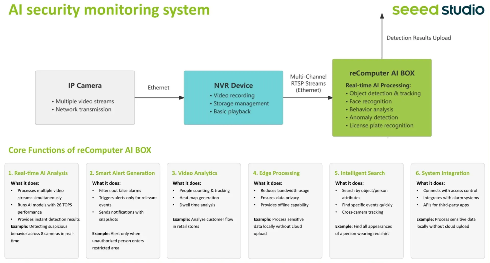

# reComputer RK3588-30 

**Summary**: Open Rockchip AI Box tailored for AI application development.
It is recommended hardware for running Horto OS. Minimum RAM requirement is 8 GB; 16 GB is preferred for advanced AI and larger Docker workloads.

**Sources**: [seeedstudio.com/reComputer-RK3588-30-p-6817.html](https://www.seeedstudio.com/reComputer-RK3588-30-p-6817.html)

## Description

reComputer RK3588-30 is an Open Rockchip AI Box tailored for AI Application Development

Order Nr: SKU 100071234

6 TOPS NPU | Open Source | 8 Core | LPDDR5 up to 32GB | Expandable to 26 TOPS via PCIe | M.2 for SSD & AI Acceleration | One Click Used with reComputer AI Lab | Armbian pre-installed | CV, LLM, VLM，STT, TTS | miniPCIe for 4G/LoRaWAN/Wi-Fi Halow | Decoder 8K@60fps | Encoder 8K@30fps | Simultaneous 4-Display Output | 2x 2.5GbE

## Feature 1：Based on Powerful RK3588 Processor

The reComputer RK3588 features an advanced CPU architecture with

- 4 × Cortex-A76 @2.4GHz
- 4 × Cortex-A55 @1.8GHz
- LPDDR5 （8GB/16GB/32GB）
- ARM Mali GPU-G610 MC4

## Feature 2：6 TOPS NPU Embedded

With a built-in **6 TOPS** **NPU**, it delivers efficient AI inference directly on the device, reducing latency and enhancing privacy without relying on the cloud.

AI performance highlights include:

- Vision CNN: YOLO11@60FPS(640*640)
- LLM: capable for deepseek-r1-distill-qwen 7b support
- VLM: capable for qwen2.5-vl 3b
- STT: whisper_base_20s (RTF 0.215) with real-time processing support
- TTS：mms_tts_eng_200 （RTF 0.069) with real-time processing support

Check the details of the [benchmark](https://sensecraft.seeed.cc/ai-lab/tutorials/rk/benchmark/cv).

## Feature 3：Compute Power & Storage & Wireless Connectivity Expandable

It offers flexible expansion through

a) 2 × M.2 M Key: PCIe 3.0 x4 and PCIe 2.1 x1, supports SSD expansion and AI accelerators such as Hailo and Rockchip， up to 26TOPS

b) 1 x miniPCIe for wireless expansion, like 4G LTE, LoRaWAN, Wi-Fi HaLow

## Related Topics
- [HORTO-OS_SETUP_1](../HORTO-OS_SETUP_1.MD)
- [HORTO-OS_SETUP_4_DOCKER](../HORTO-OS_SETUP_4_DOCKER.MD)
