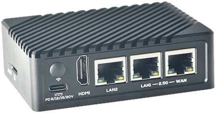

# NanoPi R6S

**Summary**: The NanoPi R6S ("R6S") is a mini IoT edge device with two 2.5G and one 1GbE Ethernet ports, based on the Rockchip RK3588S.

**Sources**: [wiki.friendlyelec.com/wiki/index.php/NanoPi_R6S](https://wiki.friendlyelec.com/wiki/index.php/NanoPi_R6S)

---

The NanoPi R6S (as “R6S”) is an open-sourced mini IoT gateway device with two 2.5G and one Gbps Ethernet ports, designed and developed by FriendlyElec. It is integrated with a Rockchip RK3588S CPU, 8GB LPDDR4x RAM and 32GB/64GB eMMC flash. It supports booting with TF cards and works with operating systems such as FriendlyWrt, Armbian etc.
  
The NanoPi R6S has rich hardware resources with a compact size of 90 x 62 mm. FriendlyElec has released a carefully-designed custom CNC housing for it. It has one HDMI port.
  
The NanoPi R6S has two USB ports, and supports USB type-C power delivery. 
  
It needs a minimum 20W USB-C PD GaN charger and a M.2 SSD half size drive to run Horto-OS.

You need to install Armbian to set it up. The Horto-OS setup sequence starts here: [Horto-OS setup 1](../Horto-OS_setup_1.md).
## Related Topics
- [Horto-OS setup 1](../Horto-OS_setup_1.md)
- [Horto-OS setup 3 – networking](../Horto-OS_setup_3_networking.md)
